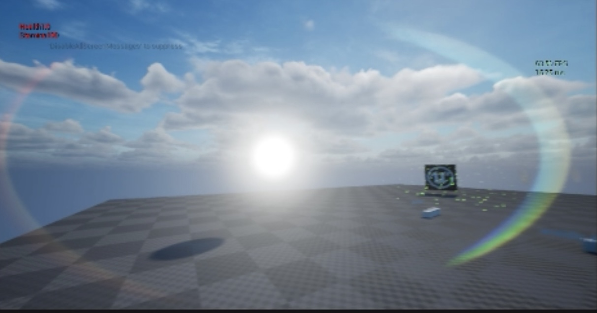

# UnrealEngineCustomLensFlare

🎞️ Lens Flare Post Process Effect 
- Unreal Engine 5

Project Overview

This project is a realistic lens flare effect created as a custom post-process material in Unreal Engine 5. It mimics the optical phenomena seen in camera lenses when looking directly at bright light sources such as the sun, headlights, or explosions.

The effect works dynamically – a rainbow halo appears only when a strong light source is perfectly centered on the screen, simulating the behavior of real-world camera lenses.

[Watch demo video](assets/Unreal_Engine_5_2025.08.06_-_01.14.19.08.mov)

⸻

✨ Features
✅ Fully dynamic and real-time lens flare behavior.

✅ Appears only when light sources are at the screen center.

✅ Designed using screen-space logic and compositing techniques.

✅ Inspired by real camera optics and cinematographic post effects.

✅ Highly customizable through Material Instances (brightness, scale, falloff, threshold, etc.).
